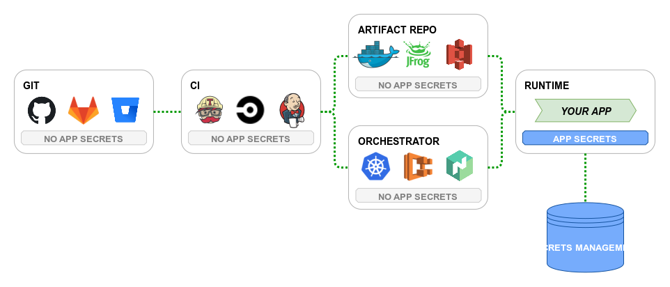

# Continuous Integration / Continuous Delivery

### Pattern for CI/CD Pattern

**What is a pipeline?**

A pipeline is typically made up of one or more steps where source code is turned into a build that is tested and deploy one or more environment until it eventually reaches the end user in production.

**Why use pipeline?**

As systems become more complex, distributed, and modular, our expectations is that systems will always perform and be available. Having a safe, fast, repeatable way of getting your changes into production is critical.

Here are some design considerations to think about when desining pipelines:
* Quality & test coverage/automation
* Security (e.g. vulnerability scanning)
* Terget environment configuration (e.g. ephemeral compute)
* Variables and secrets
* Release strategy (blue/green/canary)
* Approvals
* Auditing and compliance
* Rollback & failure strategies
* Maintaining SLAs, SLOs, SLIs

**Diffence between GOOD and BAD pipelines**

Simply put, good pipelines are fast and repeatable, great pipelines are fast, safe, and repeatable.

A great pipeline will complete in under an hour, and catch 95% of anomalies and regressions, before code reaches an end-user.

If your code takes longer than an hour to reach production, or if more than 2 out of 10 deployments fail, you might want to reconsider your pipeline design and strategy.

**Pipeline Structure Patterns**

The structure of pipelines tends to follow what they are mostly driven by. The driving goal of the pipeline has an impact on the structure and pattern the pipeline follows. 